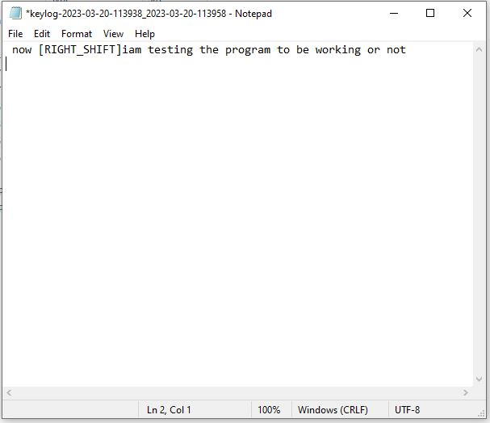

# KeyLogger_Python
This repository contains a code to create a keylogger in python that captures key strokes by the user and save them in the local .txt file.

A new file is created once the size of the file reaches to the desired value (1KB in this example)

This program could be used to log the keystrokes ainto a file an upload it to the server once it reaches the specified size while deleting it from local storage and creating a new file to store future logs. in that case the file won't get into notice (less space occupation).

the output from the keystokes lookes smothing like this:

